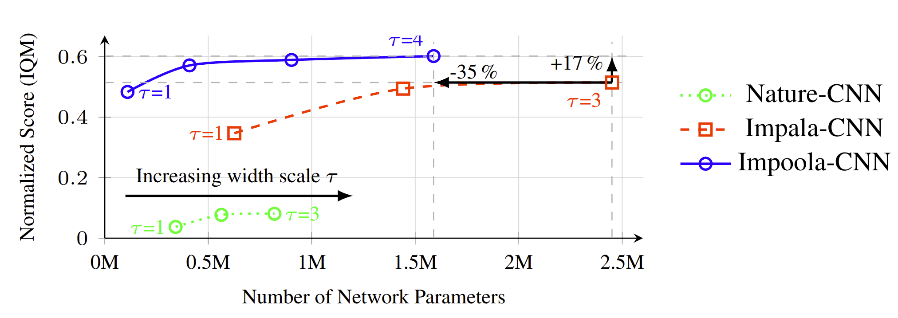
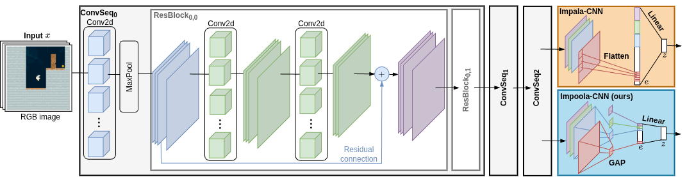

# Impoola

[](https://github.com/RichardLitt/standard-readme)

This repository is the official implementation of the [paper](https://openreview.net/forum?id=Kkw4nqaM9Y#discussion):

> **Impoola: The Power of Average Pooling for Image-based Deep Reinforcement Learning**
>
> [Raphael Trumpp](https://scholar.google.com/citations?user=2ttMbLQAAAAJ&hl=en), 
> Ansgar Schäfftlein,
> [Mirco Theile](https://scholar.google.com/citations?user=88rL5TUAAAAJ&hl=de&oi=sra),
> and [Marco Caccamo](https://scholar.google.com/citations?user=Jbo1MqwAAAAJ&hl=en&oi=ao).
> 
> **Presented at**: Reinforcement Learning Conference (RLC) 2025.

<p align="center">
  
</p>


## Table of contents
- [Background](#background)
- [Install](#install)
- [Usage](#usage)
- [Reference](#reference)
- [License](#license)

## Background
As image-based deep reinforcement learning tackles more challenging tasks, increasing model size has become an important factor in improving performance.
Recent studies achieved this by focusing on the parameter efficiency of scaled networks, typically using Impala-CNN, a 15-layer ResNet-inspired network, as the image encoder.
However, while Impala-CNN evidently outperforms older CNN architectures, potential advancements in network design for deep reinforcement learning-specific image encoders remain largely unexplored.
We find that replacing the flattening of output feature maps in Impala-CNN with global average pooling leads to a notable performance improvement.
This approach outperforms larger and more complex models in the Procgen Benchmark, particularly in terms of generalization.
We call our proposed encoder model Impoola-CNN.
A decrease in the network’s translation sensitivity may be central to this improvement, as we observe the most significant gains in games without agent-centered observations.
Our results demonstrate that network scaling is not just about increasing model size—efficient network design is also an essential factor.

<p align="center">
  
</p>


## Install
- We recommend using a virtual environment for the installation:
  ```bash
  python -m venv impoola
  source impoola/bin/activate
  ```
- Activate the environment and install the following packages:
  ```bash
  pip install torch torchrl numpy tyro matplotlib torchinfo wandb torch-pruning procgen stable_baselines3 tqdm gym==0.26.2 gymnasium==0.28.1
  ```
## Usage
The PPO agent can be trained with the following command
```bash
python ppo_training.py
```
and DQN with
```bash
python dqn_training.py
```
We provide launch files for both PPO and DQN in the `benchmark_utils` folder, allowing to run experiments with different seeds across multiple GPUs.
Results will be logged to Weights & Biases, so make sure to set up your W&B account and API key.
Command line arguments are managed with tyro and are defined in each *_training.py file.
For example, the Progen Benchmark environment can be specified with the `--env` argument:
```bash
python ppo_training.py --env_id fruitbot
```

Our default points to the generalization track with 200 training levels and 25M training steps.
The hard setting can be specified with the `--distribution_mode` argument:
```bash
python ppo_training.py --env_id fruitbot --distribution_mode hard
```

Tools for plotting results and analyzing the trained models are provided in the `plot_utils` folder.
They use a customized rlops package and openrlbenchmark.

## Reference
If you find our work useful, please consider citing our paper:

```bibtex 
@inproceedings{
    trumpp2025impoola,
    title={Impoola: The Power of Average Pooling for Image-based Deep Reinforcement Learning},
    author={Raphael Trumpp and Ansgar Sch{\"a}fftlein and Mirco Theile and Marco Caccamo},
    booktitle={Reinforcement Learning Conference},
    year={2025},
    url={https://openreview.net/forum?id=Kkw4nqaM9Y}
}
```

## License
[GNU General Public License v3.0 only" (GPL-3.0)](LICENSE.txt) © [raphajaner](https://github.com/raphajaner)
